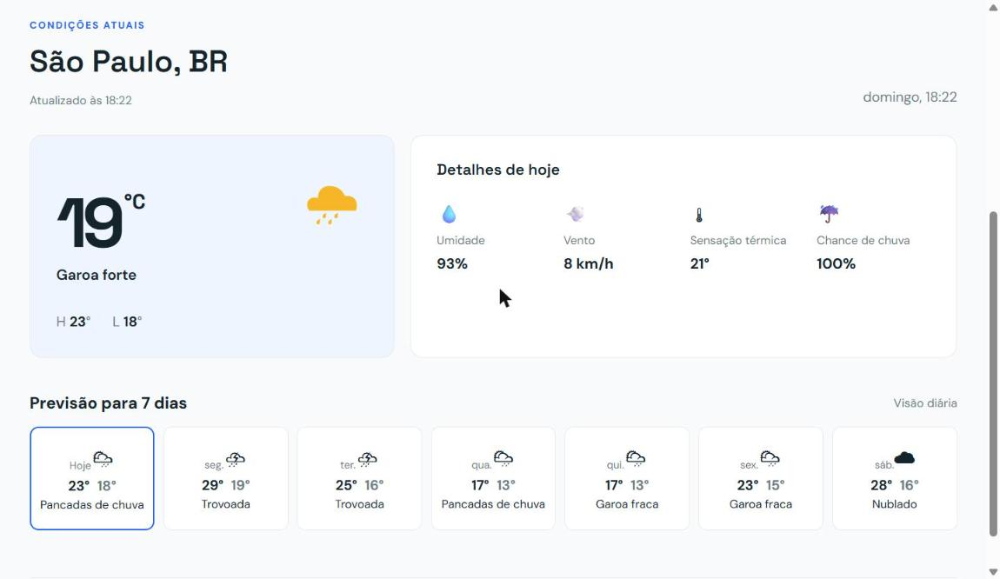

# SkyCast — Painel de previsão do tempo

[](https://github.com/ruangdev0-ux/skycast/actions/workflows/deploy.yml)

Aplicação web que mostra as condições atuais e a previsão de 7 dias para qualquer cidade do mundo, feita com JavaScript, Vite e a API gratuita [Open-Meteo](https://open-meteo.com/).

**Demonstração ao vivo:** https://ruangdev0-ux.github.io/skycast/



## Objetivo

Este é um projeto de portfólio. A ideia é demonstrar, em uma aplicação pequena e funcional, o consumo de uma API REST com JavaScript, a atualização da interface a partir dos dados recebidos, o tratamento de erros e a publicação automática do site com GitHub Actions e GitHub Pages.

## Funcionalidades

- Busca por nome de cidade, usando a API de geocodificação do Open-Meteo.
- Botão "Usar minha localização", que utiliza a Geolocation API do navegador.
- Condições atuais: temperatura, sensação térmica, umidade, velocidade do vento e chance de chuva.
- Temperatura máxima e mínima do dia.
- Previsão de 7 dias, com ícone e descrição das condições do tempo.
- Mensagens de erro claras: cidade não encontrada, dados indisponíveis e permissão de localização negada.
- Interface em português (PT-BR).
- Layout adaptado para telas menores (ponto de quebra em 760px).
- Acessibilidade básica: rótulo para leitores de tela no campo de busca e região `aria-live` para as mensagens de status.

## Tecnologias utilizadas

- HTML5, CSS3 e JavaScript (módulos ES, `fetch` e `async/await`)
- [Vite](https://vitejs.dev/) 5 como servidor de desenvolvimento e ferramenta de build
- [Open-Meteo](https://open-meteo.com/): APIs de previsão do tempo e de geocodificação
- Google Fonts (DM Sans e Space Grotesk)
- Git e GitHub, com GitHub Actions e GitHub Pages para o deploy

## API utilizada

O SkyCast usa a [API Open-Meteo](https://open-meteo.com/en/docs), que não exige chave de API.

| Serviço | Endpoint | Para que é usado |
| --- | --- | --- |
| Geocodificação | `https://geocoding-api.open-meteo.com/v1/search` | Converter o nome da cidade em latitude e longitude |
| Previsão | `https://api.open-meteo.com/v1/forecast` | Obter as condições atuais e a previsão diária de 7 dias |

Dados consultados: temperatura, sensação térmica, umidade relativa, velocidade do vento e código do tempo (condições atuais); e código do tempo, temperaturas máxima e mínima e probabilidade máxima de precipitação (previsão diária).

## Como funciona

1. O nome da cidade digitado é enviado à API de geocodificação, que devolve latitude e longitude.
2. Com as coordenadas, o app consulta a API de previsão e recebe as condições atuais e os dados diários.
3. O código numérico do tempo (padrão WMO) é convertido em ícone e descrição em português.
4. A interface é atualizada com os dados, ou exibe uma mensagem amigável se algo falhar.

## Como executar localmente

Pré-requisito: [Node.js](https://nodejs.org/) 18 ou superior.

```bash
git clone https://github.com/ruangdev0-ux/skycast.git
cd skycast
npm install
npm run dev
```

Abra o endereço exibido no terminal (normalmente `http://localhost:5173`).

Para gerar a versão de produção: `npm run build` (arquivos em `dist/`) e `npm run preview` para testá-la localmente.

## Estrutura do projeto

```
skycast/
├── .github/workflows/deploy.yml   # build e deploy no GitHub Pages
├── docs/dashboard.png             # captura de tela usada neste README
├── public/preview.png             # imagem de prévia ao compartilhar o link
├── src/
│   ├── main.js                    # chamadas às APIs, renderização e eventos
│   └── style.css                  # estilos
├── index.html
├── package.json
└── vite.config.js
```

## Deploy

A cada push na branch `main`, um workflow do GitHub Actions instala as dependências, executa `npm run build` e publica a pasta `dist/` no GitHub Pages, em https://ruangdev0-ux.github.io/skycast/

## Organização das branches

- `main`: versão estável, publicada no GitHub Pages
- `develop`: integração de novas funcionalidades
- `feature/*`: desenvolvimento de cada funcionalidade separadamente

## Próximos passos

As melhorias planejadas estão registradas como [issues](https://github.com/ruangdev0-ux/skycast/issues) e organizadas no [quadro do projeto](https://github.com/users/ruangdev0-ux/projects/3):

- Alternar entre °C e °F
- Previsão hora a hora
- Tema escuro
- Testes automatizados
- Lembrar a última cidade pesquisada

## Autor

Ruan Gomes, estudante de Análise e Desenvolvimento de Sistemas.

- GitHub: [@ruangdev0-ux](https://github.com/ruangdev0-ux)
- LinkedIn: [Ruan Gomes](https://www.linkedin.com/in/ruan-gomes-805029393)

## Créditos

Dados meteorológicos fornecidos por [Open-Meteo](https://open-meteo.com/).
